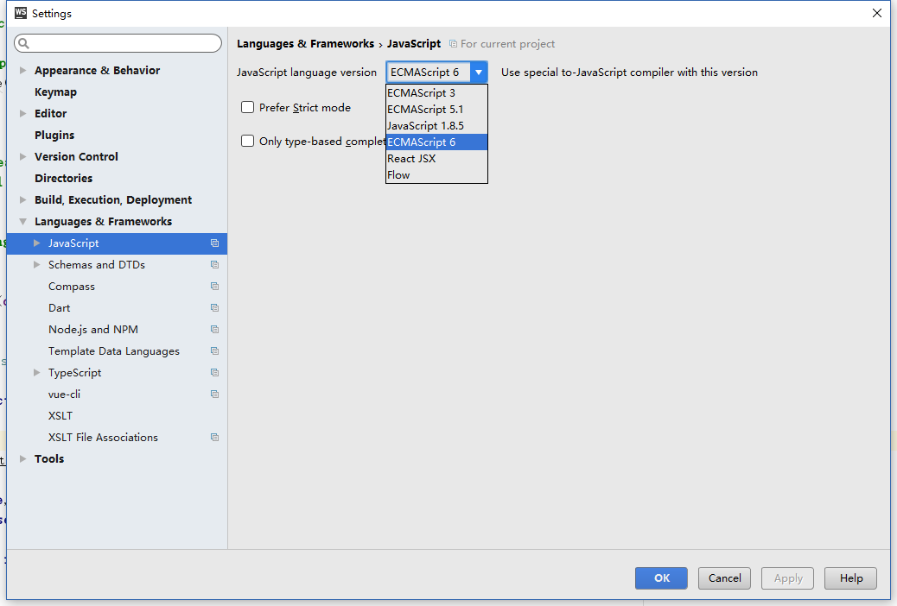
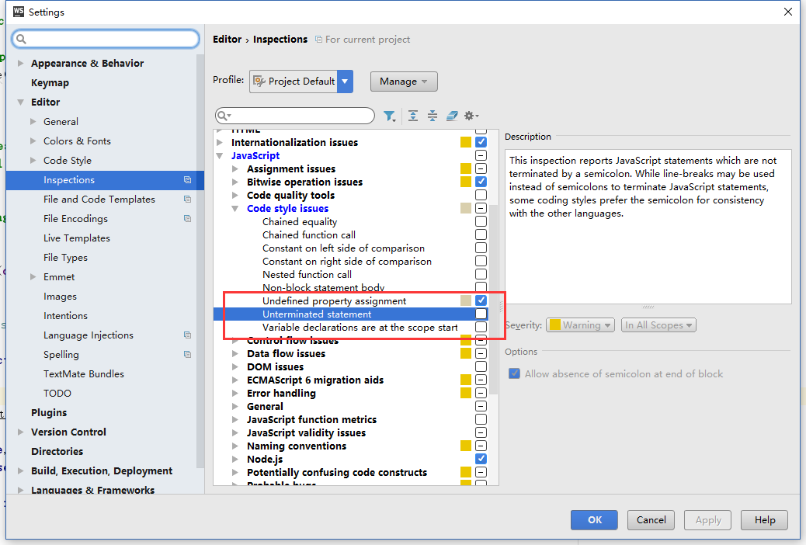
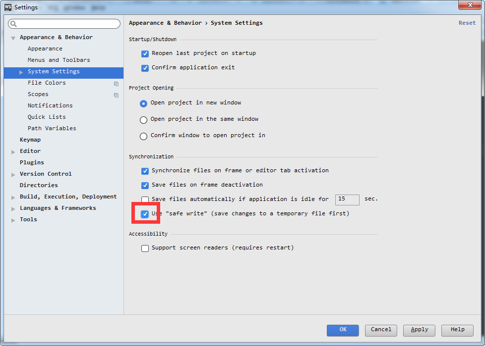
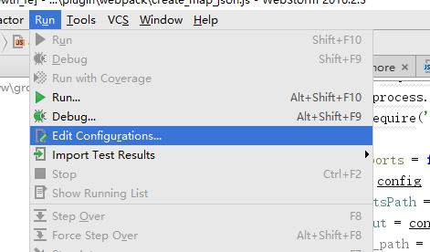
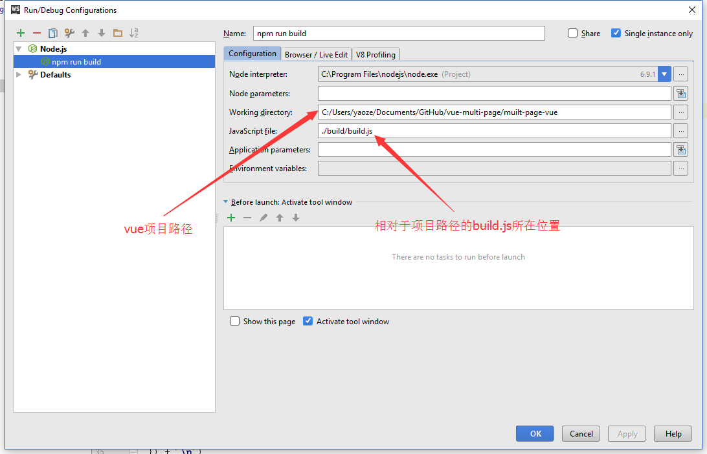
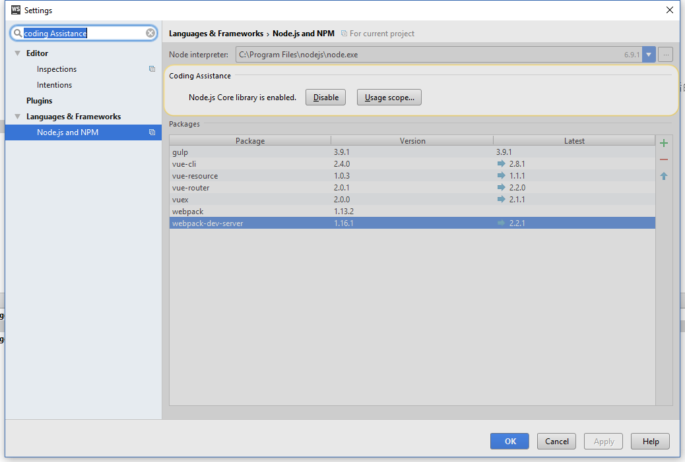
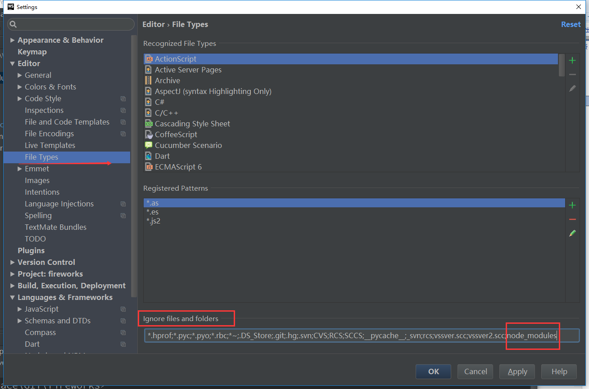
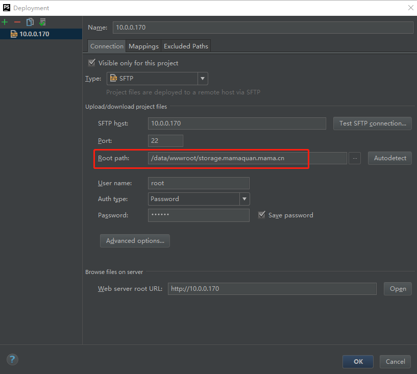
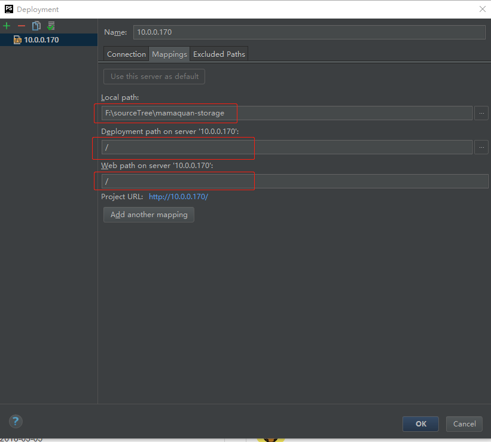

原文：https://github.com/YaoZeyuan/vue-multi-page

WebStorm配置

在修改代码之前要先处理下WebStorm的配置问题，否则代码改起来会比较别扭
1.  将js模式改为ES6模式，否则的话各种报错，没有import方法etc

2.  关闭分号缺失提示

vue-cli生成的模版里是不带分号的，所以需要在WebStorm里关掉分号缺失自动报错功能

方法为：Setting中搜索unterminated ，去掉打钩

3.  关闭safe-write功能

这个选项会让WebStorm保存之后不直接写到原文件里，导致webpack dev模式监听不到文件变化，从而也就不会重新编译代码，只有重新运行`npm run dev`才能加载新代码，非常麻烦
所以一定要关掉它

方法：Setting中搜索 `safe write`, 在System Setting里

4.  添加debug功能

我们在测试webpack功能的时候(例如写插件)需要单步执行命令，这时候就需要进行一下配置

1.

2.
  

5.  【可选】打开node.js的库函数提示

WebStorm支持对node.js自带的库函数进行提示,在设置中搜索`coding assistance`点击`enable`即可

6.  忽略node_modules目录
editor -> File Types -> Ignore files and folders

如上图所示添加node_modules目录到忽略文件列表里面，点击应用就可以了。

7. deployment 设置远程开发机忽略目录
Tools->Deployment->configruation->Excluded Path

8. webstorm 设置 vue 不顶格的方法
https://segmentfault.com/q/1010000013079361

### 遇到的问题
deployment 已连接，但无法上传，因为与本地目录不一致

